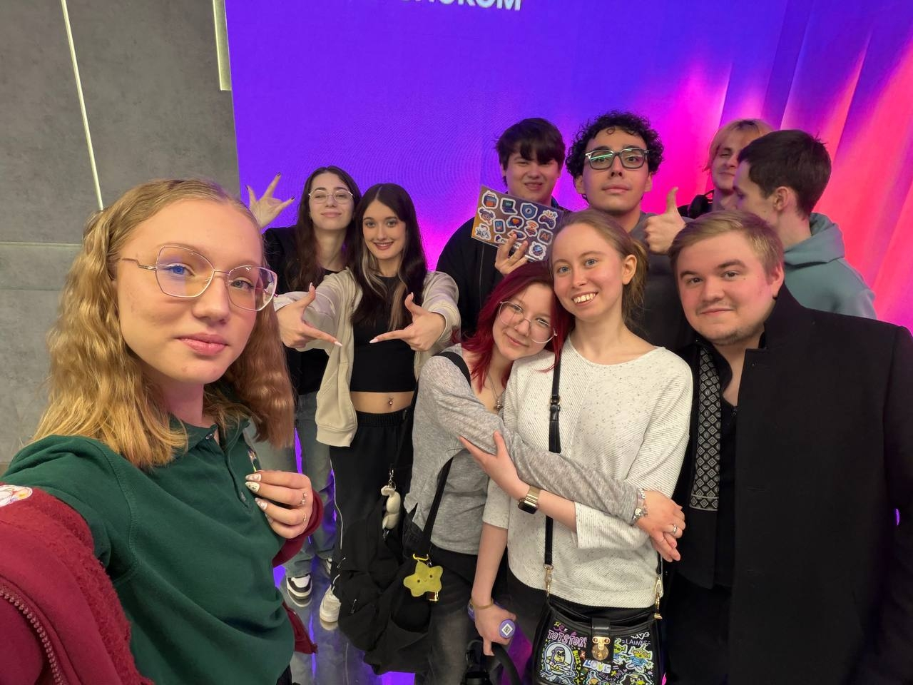
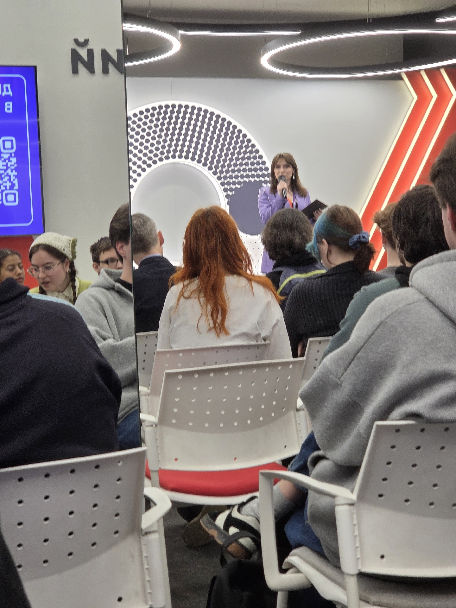
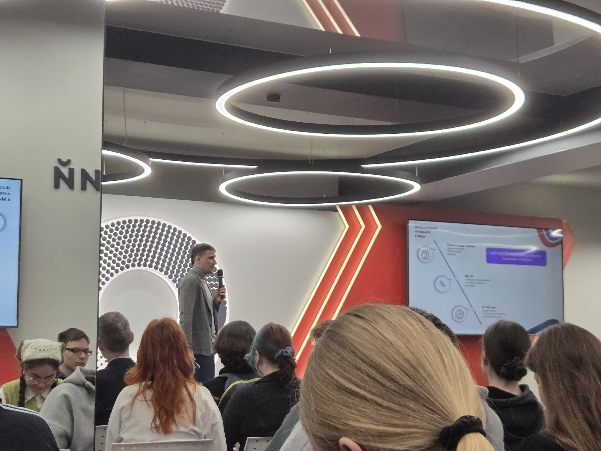
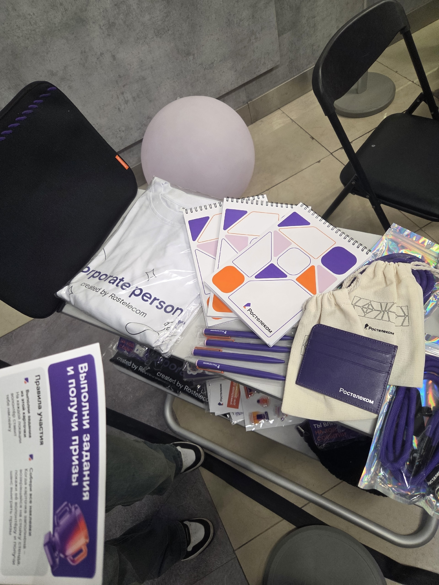

# Отчёт по 1‑й части, 4‑му заданию проектной практики «Взаимодействие с организацией‑партнёром»

## Посещение мероприятия «День карьеры Ростелекома в Московском Политехе»

В рамках мероприятия были задействованы три тематических направления, каждое из которых позволило участникам получить ценные знания и опыт:

## Образовательный трек

Насыщенная программа включала лекции и мастер‑классы по актуальным темам:

- цифровые технологии и их роль в современной экономике;
- устройство интернета и принципы работы сетевой инфраструктуры;
- ИТ‑сервисы и их применение в бизнес‑процессах;
- карьерное развитие в IT: стратегии роста и ключевые компетенции;
- использование искусственного интеллекта в различных сферах — от телекоммуникаций и аналитики данных до автоматизации бизнес‑процессов и клиентского сервиса.

Спикеры продемонстрировали реальные кейсы внедрения ИИ в проектах Ростелекома, рассказали о перспективных направлениях и востребованных навыках для специалистов в этой области.

## Карьерный трек

Практическая часть мероприятия была ориентирована на подготовку к трудоустройству:

- **Разбор резюме:** эксперты давали индивидуальные рекомендации по оформлению и структурированию документов.
- **Консультации HR‑специалистов:** участники могли задать вопросы о вакансиях, корпоративной культуре и программах стажировок.
- **Демо‑собеседования:** имитация реальных интервью с обратной связью от рекрутеров.
- **Советы по трудоустройству:** лайфхаки для успешного прохождения этапов отбора и адаптации на новом месте работы.

## Развлекательная зона

Неформальная часть программы помогла расслабиться и пообщаться в непринуждённой обстановке:

- Интересные игровые квесты;
- розыгрыши брендированного мерча от Ростелекома.

---

## Итоги

«День карьеры Ростелекома» в Московском Политехе стал значимым событием для студентов, заинтересованных в развитии карьеры в сфере IT и цифровых технологий. Участники получили комплексную информацию о деятельности компании, актуальных трендах отрасли и востребованных компетенциях.

Наибольший отклик вызвали:

- мастер‑классы с разбором реальных кейсов;
- персональные консультации HR‑специалистов;
- возможность пройти демо‑собеседование и получить конструктивную обратную связь.

Мероприятие наглядно продемонстрировало готовность Ростелекома к сотрудничеству с вузами: компания не только знакомит молодёжь с профессией, но и создаёт условия для старта карьеры через стажировки, обучающие программы и наставничество. Такой подход способствует укреплению связи между образованием и индустрией, помогая молодым специалистам сделать осознанный выбор профессионального пути.
### Фотоотчёт с мероприятия

